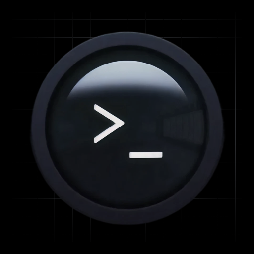

<p align="center">
  
</p>

<h1 align="center">Terminal GUI</h1>

<p align="center">
  <strong>A multi-pane terminal manager built with Bun + React.</strong><br/>
  Split, stack, and theme your terminals. Chat with AI agents inline. Ship faster.
</p>

<p align="center">
  
  
  
  
  
</p>

---

## What is this?

Terminal GUI is a browser-based terminal multiplexer with first-class AI agent support. Think tmux meets a modern web app — with Claude and Codex living right next to your shell sessions.

Every pane is a real PTY. Every agent chat is a real conversation. Everything runs on a single Bun server at `localhost:4000`.

## Features

**Multi-pane terminals**

- Grid or row layouts with drag-to-reorder
- Groups (tabs) for organizing workspaces
- Per-pane directory picker — start anywhere on your filesystem
- Real shell sessions via Bun's native PTY

**AI agents inline**

- Claude and Codex chat panes alongside your terminals
- Slash commands (`/review`, `/refactor`, `/debug`, `/test`, etc.)
- Custom prompt library — create, edit, and manage your own `/commands`
- Usage tracking across prompts

**Theming**

- 12 built-in themes (Nord, Dracula, Solarized, Monokai, GitHub, Ocean, Rose Pine, and more)
- Unified theme system — one pick changes both the app UI and terminal colors
- Custom theme builder with live preview
- Font family and size controls
- Pane opacity slider

**Native desktop app**

- Packaged with Electrobun for macOS
- DMG installer with drag-to-Applications
- Runs as a standalone native app

**Developer sidebar**

- Running ports monitor (auto-detects 3000-4000 range)
- Claude process manager — view, kill, bulk kill
- Real-time WebSocket state sync

## Download

Download the latest release from our website and drag to Applications.

## Building from Source

Terminal GUI can be packaged as a native macOS app using [Electrobun](https://electrobun.dev).

### Build the DMG

```bash
# Install dependencies
bun install

# Build the app and create polished DMG installer
bash scripts/build-dmg.sh
```

After the build completes, you'll find the installer at `artifacts/Terminal-GUI-Installer.dmg`.

### Test Locally

```bash
open artifacts/Terminal-GUI-Installer.dmg
```

Mount the DMG, drag the app to Applications, and run it.

### Installing (for Users)

1. Download the `.dmg` file
2. Double-click to mount it
3. Drag **Terminal GUI** to your **Applications** folder
4. First launch: Right-click the app → **Open** (to bypass unsigned app warning)
   - Or run: `xattr -cr /Applications/Terminal\ GUI.app`
5. The app is now ready to use

### Code Signing (Optional)

For public distribution without security warnings, you'll need an Apple Developer account ($99/year).

Add to `electrobun.config.ts`:

```typescript
mac: {
  codesign: true,
  notarize: true,
}
```

Set environment variables:

```bash
export ELECTROBUN_DEVELOPER_ID="Your Developer ID"
export ELECTROBUN_TEAMID="XXXXXXXXXX"
export ELECTROBUN_APPLEID="your@email.com"
export ELECTROBUN_APPLEIDPASS="app-specific-password"
```

Then rebuild with `--env=stable`.

## Project structure

```
terminal-gui/
  index.ts              Bun server entry — routes, WebSocket, static files
  index.html            App shell with theme preloader
  src/
    main.tsx            React entry point
    app.tsx             Router — Terminal + Prompts pages
    components/         Shared UI (icons, buttons, chat view, sidebar)
    pages/
      Terminal/         Multi-pane terminal — grid, settings, agent sidebar
      PromptsPage/      Slash command library (CRUD)
    hooks/              usePrompts, usePollingResource, usePorts, etc.
    lib/                Theme engine, WebSocket client, terminal utils, agents
    server/
      routes/           API routes (terminal, prompts, config, files, etc.)
      services/         PTY management, chat service, checkpoint service
      agents/           Claude/Codex adapter registry
      lib/              Path utils, route helpers
    data/
      prompts.json      Slash command library (local JSON)
  public/               App icons, DMG background
```

## Tech stack

- **Runtime**: [Bun](https://bun.sh) — server, bundler, and package manager
- **Frontend**: React 19, React Router, TanStack Query
- **Terminal**: xterm.js with fit and web-links addons
- **Styling**: Tailwind CSS v4
- **Linting**: Biome
- **Transport**: Native WebSocket (Bun.serve)

## License

This project is source-available for reference and educational purposes. All rights are reserved by the author.

You may **not** use, copy, modify, distribute, or deploy this software without explicit written permission from the author. If you'd like to use Terminal GUI in your own project or organization, please reach out to request a license.

See [LICENSE](LICENSE) for the full terms.
